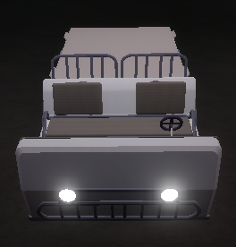
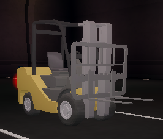

Engineering personnel are granted access to two [2] special vehicles to be used when performing department duties. These vehicles are not to be abused under any circumstances.

| Vehicle | Description |
| ------- | ----------- |
|  | The EUC or the Electric Utility Cart is a vehicle that may be used by engineering personnel to transport the parts needed to repair any technical appliances or to transport fuel cells to the Dark Matter Reactor. It is capable of transporting 3 parts or fuel cells at a time.

Engineering personnel are not permitted to transport materials if Logistics Officers are on-site. They are instead to request for them to bring the parts to either Site Alpha or the Technical Wing. |
|  | The forklift is a vehicle capable of transporting a maximum of one [1] passenger on its forks.

Engineering personnel are NOT permitted to use forklifts. | 

- Engineering personnel are to abide by the **road laws** when utilising any of the vehicles to perform department duties.

:::warning
Failure to abide by the road laws and the vehicle regulations stated above may result in appropriate punishments to be administered by the Ethics Committee, the Military Police and the E&TS Command Team.
:::

- Engineering personnel may disregard red traffic signals when transporting materials and/or fuel cells and may drive past the speed limit when transporting items during any protocol aside from Blue Sky or Yellow Ember.