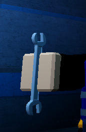
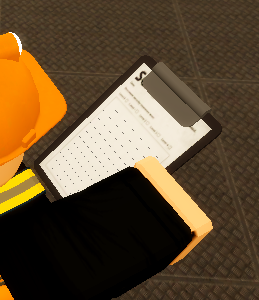

| Clipboard                                                                                                                            | Tool Description                                                                                                                                                                                                                                                                   |
|--------------------------------------------------------------------------------------------------------------------------------------|------------------------------------------------------------------------------------------------------------------------------------------------------------------------------------------------------------------------------------------------------------------------------------|
|                  | A wrench is a tool that engineering personnel may use to repair broken windows. To repair a broken window, approach it, and hold the key shown on the proximity prompt. 

Windows may not be repaired 15 seconds prior to it being destroyed unless all rogue Class-Ds within the area have been terminated by any combative personnel before the end of the given timeframe.

As of 1/2022, wrenches are not capable of repairing broken windows.
|
|Clipboard                                                                                                                     |                                                                                                                                                                                                                                                                    |
|  | The clipboard is used to write and store notes. They are encouraged to be used when inspecting areas of the facility and when keeping track of what has been broken and repaired. Clipboards are not to be used immaturely. Doing so will result in a verbal or written warning. In addition, Clipboards are not to be used to bypass the filter or type classified information. |